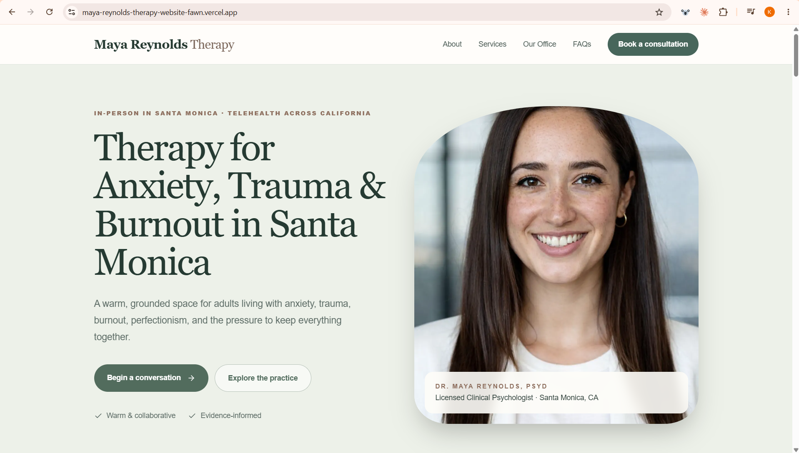
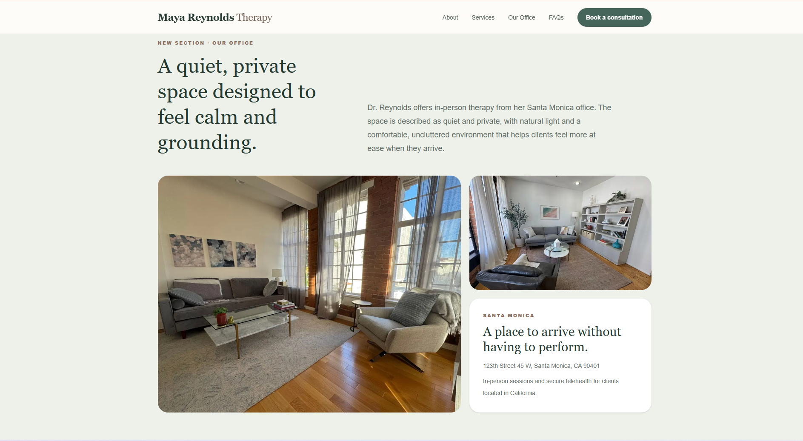

# 🌿 Dr. Maya Reynolds — Therapy Website

<p align="center">
  <strong>A calm, modern, and responsive therapy website designed for Dr. Maya Reynolds, PsyD.</strong>
</p>

<p align="center">
  <a href="https://maya-reynolds-therapy-website-fawn.vercel.app/">
    <strong>🌐 View Live Website</strong>
  </a>
</p>

---

## ✨ Project Overview

This project is a **design-focused therapist website** created as part of the **GrowMyTherapy Front-End Developer practical assignment**.

The website was designed for **Dr. Maya Reynolds, PsyD, a Licensed Clinical Psychologist based in Santa Monica, California**.

The goal was to create a digital experience that feels:

- 🌿 Calm and grounded
- 🤍 Warm and welcoming
- 🧠 Professional and trustworthy
- ✨ Modern and design-focused
- 📱 Responsive across desktop and mobile

The website's content and visual direction were developed around the provided Dr. Maya Reynolds profile.

---

## 🖥️ Website Preview

### Desktop — Homepage

<p align="center">
  
</p>

### 🏡 Our Office — Custom Section

<p align="center">
  
</p>

> **Mobile preview:** The deployed website is responsive and can be viewed on smaller screens using the live link below.

---

## 🎯 Project Goals

The website was built around four core goals:

1. **Recreate the structure and user experience of the reference website**
2. **Create a new visual identity for Dr. Maya Reynolds**
3. **Communicate her areas of expertise clearly and naturally**
4. **Provide a responsive experience across desktop and mobile**

The final design combines a spacious editorial layout, soft natural colors, intentional photography, clear typography, and client-focused messaging.

---

## 🎨 Design Direction

The visual identity was intentionally designed around the feeling of **calm, safety, reflection, and trust**.

### Color Palette

The website uses:

- Soft sage greens
- Warm cream and neutral tones
- Deep natural green
- Subtle earthy accents

The palette creates a softer, more welcoming alternative to a typical clinical visual style.

### Typography & Layout

The design uses:

- Large editorial-style headings
- Clean and readable body text
- Generous whitespace
- Clear visual hierarchy
- Rounded image treatments
- Structured content sections
- Responsive layouts

The overall intention was to make the website feel **premium without feeling intimidating**.

---

## 👩‍⚕️ About Dr. Maya Reynolds

The website is centered around Dr. Maya Reynolds, PsyD, a Licensed Clinical Psychologist based in Santa Monica, California.

Her practice supports adults experiencing:

- Anxiety and panic
- Trauma and the effects of past experiences
- Burnout
- Perfectionism
- High internal pressure
- Emotional exhaustion
- Difficulty slowing down or feeling grounded

Her therapeutic approach is presented as **warm, collaborative, and grounded**, combining practical tools with room for reflection and deeper work.

---

## 🧠 Areas of Focus

The website organizes the practice into three primary areas:

### Anxiety & Panic

Support for adults experiencing persistent worry, physical tension, difficulty sleeping, feeling on edge, and panic.

### Trauma Therapy

A carefully paced approach to working with both single-incident trauma and longer-standing patterns connected to childhood, relationships, and chronic stress.

### Burnout & Perfectionism

Support for professionals, entrepreneurs, and creatives experiencing high internal pressure, exhaustion, perfectionism, or difficulty maintaining a sustainable pace.

---

## 🌱 Therapeutic Approach

The website communicates the therapeutic approaches described in the provided profile:

- **Cognitive Behavioral Therapy (CBT)**
- **EMDR**
- **Mindfulness-based practices**
- **Body-oriented techniques**

The content balances practical tools with emotional understanding, safety, and deeper reflection.

---

## 🏡 Custom "Our Office" Section

A dedicated **Our Office** section was added as a completely new section for the assignment.

The section communicates the qualities of the Santa Monica practice environment:

- Quiet
- Private
- Comfortable
- Uncluttered
- Naturally lit
- Calm and grounding

It also communicates the available formats:

- In-person therapy from the Santa Monica office
- Secure telehealth for clients located in California

The office imagery was used to help potential clients visualize the environment before reaching out.

---

## 📱 Responsive Experience

The website was designed to adapt across different screen sizes.

### Desktop

- Spacious multi-column layouts
- Large editorial typography
- Full-width visual sections
- Structured navigation
- Balanced whitespace

### Mobile

- Stacked content sections
- Responsive typography
- Compact navigation
- Flexible images
- Touch-friendly buttons
- Single-column layouts
- Comfortable reading spacing

The goal was to preserve the same calm and accessible experience on smaller screens.

---

## 🔎 SEO & Content

The homepage uses specialty- and location-focused messaging.

### Primary H1

> **Therapy for Anxiety, Trauma & Burnout in Santa Monica**

The content naturally communicates relevant topics such as:

- Anxiety therapy
- Trauma therapy
- Burnout
- Panic
- Perfectionism
- Santa Monica
- California
- Telehealth

The messaging is written for potential clients rather than using unnecessarily technical language.

---

## ⭐ Key Features

- Responsive navigation
- SEO-focused homepage
- Therapist profile section
- Three primary service areas
- Therapy approach section
- Custom **Our Office** section
- FAQ accordion
- Multiple calls to action
- Responsive image layouts
- Mobile-responsive design
- Santa Monica location positioning
- In-person and telehealth information
- Descriptive image alt text
- Component-based Next.js structure

---

## 🛠️ Tech Stack

| Technology | Purpose |
|---|---|
| **Next.js** | Application framework |
| **React** | UI development |
| **TypeScript** | Type-safe development |
| **Tailwind CSS** | Styling and responsive layouts |
| **Next/Image** | Image handling and optimization |
| **Vercel** | Production deployment |
| **GitHub** | Version control and source repository |

---

## 📁 Project Structure

```text
maya-reynolds-therapy-website/
│
├── app/
│   ├── page.tsx
│   ├── layout.tsx
│   └── globals.css
│
├── public/
│   ├── images/
│   │   ├── maya-reynolds.jpg
│   │   ├── intro.jpg
│   │   ├── anxiety.jpg
│   │   ├── trauma.jpg
│   │   ├── burnout.jpg
│   │   ├── office-1.jpg
│   │   └── office-2.jpg
│   │
│   └── readme/
│       ├── desktop-home.png
│       └── office-section.png
│
├── package.json
├── package-lock.json
├── tsconfig.json
├── next.config.ts
├── postcss.config.mjs
├── .gitignore
└── README.md
```

---

## 🚀 Getting Started

### Clone the repository

```bash
git clone https://github.com/YOUR_USERNAME/maya-reynolds-therapy-website.git
cd maya-reynolds-therapy-website
```

### Install dependencies

```bash
npm install
```

### Start the development server

```bash
npm run dev
```

Open:

```text
http://localhost:3000
```

### Create a production build

```bash
npm run build
```

### Start the production server

```bash
npm start
```

---

## ☁️ Deployment

The website is deployed on **Vercel** and connected to the GitHub repository.

### 🌐 Live Website

<p align="center">
  <a href="https://maya-reynolds-therapy-website-fawn.vercel.app/">
    <strong>https://maya-reynolds-therapy-website-fawn.vercel.app/</strong>
  </a>
</p>

---

## 📌 Assignment Highlights

| Requirement | Status |
|---|---|
| Homepage structure recreation | ✅ |
| New visual theme | ✅ |
| Therapist-specific content | ✅ |
| SEO-focused heading | ✅ |
| Three relevant services | ✅ |
| Therapist profile | ✅ |
| Intentional imagery | ✅ |
| Custom "Our Office" section | ✅ |
| FAQ section | ✅ |
| Responsive desktop design | ✅ |
| Responsive mobile design | ✅ |
| Production deployment | ✅ |
| Public GitHub repository | ✅ |

---

## 👨‍💻 Developer

### Kamlesh Pawar

**Front-End Developer | Software Engineer Intern**

Focused on building modern, responsive, and user-centered web experiences.

---

## 🔗 Project Links

**🌐 Live Website**  
https://maya-reynolds-therapy-website-fawn.vercel.app/

**💻 GitHub Repository**  
Add your final public GitHub repository URL here.

---

<p align="center">
  <strong>Designed with clarity, warmth, and a focus on the client experience.</strong>
</p>

<p align="center">
  🌿 Next.js · React · TypeScript · Tailwind CSS · Vercel
</p>
